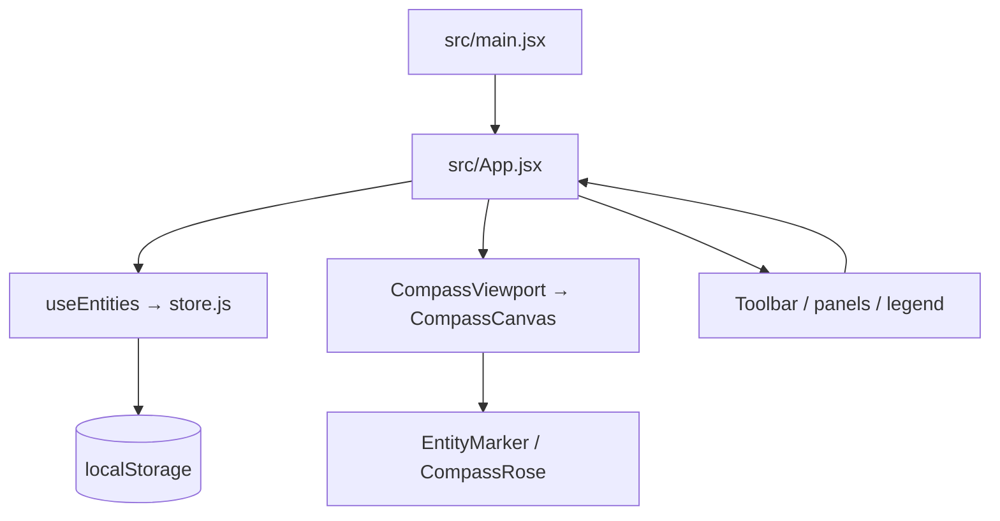

# Political Compass — Architecture

> Maintainer’s map for the Interactive Political Compass. Read this file before changing a feature. It explains which module owns each responsibility, how data moves through the application, which contracts must remain stable, and where to start when debugging or extending the product.

**Snapshot:** v0.3.0 · Phase 3 promoted to `main`  
**Application:** React + Vite single-page app  
**Persistence:** browser `localStorage` only  
**Primary release:** GitHub Pages from `main`; Netlify configuration is also retained

## How to use this document

1. Find the feature in the “Feature-to-file index” before opening source files.
2. Read the relevant contract section before changing data shape, coordinate math, or event ownership.
3. Make the smallest change in the owning layer. Do not move persistence, coordinate conversion, or normalization into a presentation component.
4. Update or add a focused test when a domain contract changes.
5. Run `npm test` and `npm run build` before publishing. If deployment-related files change, also run `GITHUB_ACTIONS=true npm run build` and confirm asset paths use `/Political-Compass/`.

## 1. Product boundary

Political Compass is a personal, local-first visual instrument. The chart is the interface: it is not wrapped in a dashboard or backed by an account system.

### In scope

- A 2D economic/social political compass from `-10` to `+10` on both axes.
- Four atmospheric quadrant washes and a brass compass rose centered at the origin.
- Zoom, pan, reset-to-fit, and a one-shot sonar-style zoom ping.
- Immersive Full View mode that hides instrument controls while preserving pan and zoom.
- People, parties, organizations, and ideologies represented as draggable markers.
- Add/edit/delete/detail workflows, including quick-add from an empty chart location.
- Name search, multi-select type filters, and an empty filtered-state reset.
- Versioned JSON export and validated import with merge-by-default behavior.
- Browser-local autosave and image data URLs for v1.

### Deliberately out of scope

- Authentication, accounts, analytics, ads, or a backend.
- Cross-device sync, Supabase, public read-only charts, and share links.
- Compare mode and starter-chart selection.
- Server-side rendering or a server API.

If a new feature requires one of those capabilities, update the product plan and data-layer boundary first rather than adding a one-off implementation inside `App.jsx`.

## 2. Runtime map



### Startup sequence

1. `src/main.jsx` imports global CSS and mounts `<App />` inside React `StrictMode`.
2. `App` calls `useEntities()`.
3. `useEntities` lazily calls `loadEntities()` once for initial state.
4. `loadEntities()` reads `localStorage` key `political-compass.entities.v1`.
5. Missing, malformed, or unavailable storage falls back to normalized `SAMPLE_ENTITIES`.
6. The first `entities` effect writes the normalized state back through `saveEntities()` when storage is available.
7. `App` derives `visibleEntities` from the full entity list, search query, and active type set.
8. `CompassViewport` owns transform interaction; `CompassCanvas` receives the filtered entities and renders the instrument.

### Component relationship summary

| Module | Owns | Does not own |
| --- | --- | --- |
| `src/main.jsx` | React mount and global stylesheet import | Application state or feature logic |
| `src/App.jsx` | Cross-feature state, event orchestration, filtering, transfer actions | SVG drawing details, localStorage calls, form field layout |
| `CompassViewport.jsx` | Pan/zoom transform and zoom controls | Entity coordinates or marker selection |
| `CompassCanvas.jsx` | Static SVG instrument layers, pointer-to-chart conversion, marker composition | Entity persistence or form state |
| `CompassRose.jsx` | Origin compass rose geometry | Coordinate conversion or interactions |
| `EntityMarker.jsx` | One entity’s SVG marker, image/initials, selection/click/drag events | Entity mutation or persistence |
| `ChartToolbar.jsx` | Search field, type chips, import/export controls | Filtering logic or file parsing |
| `EntityPanel.jsx` | Add/edit form state, validation, image upload, numeric coordinate controls | Creating/updating entities directly |
| `EntityDetailCard.jsx` | Selected entity presentation and edit/delete intents | Delete confirmation or data mutation |
| `ImportReview.jsx` | Import preview and merge/replace intents | JSON parsing or replacement confirmation |
| `Legend.jsx` | Collapsible quadrant definitions | Chart state or filtering |
| `useEntities.js` | React bridge over entity operations and autosave | Rendering or import parsing |
| `lib/store.js` | Storage adapter boundary | UI state or DOM access outside storage |
| `lib/entities.js` | Entity shape, type constants, normalization, IDs | Rendering or persistence |
| `lib/coordinates.js` | Coordinate contract and math | React state or SVG component structure |
| `lib/portable.js` | Import/export envelope, validation, dedupe, merge | File picker UI or localStorage |
| `lib/image.js` | Browser image-to-data-URL conversion | Entity creation or persistence |
| `styles.css` | Design tokens, layout, responsive rules, SVG visual treatment | Business logic |

## 3. State ownership in `App.jsx`

`App` is intentionally the composition/orchestration layer. Feature components emit callbacks; `App` decides what those callbacks do.

| State | Type | Owner | Meaning and consumers |
| --- | --- | --- | --- |
| `entities` | `Entity[]` | `useEntities` | Complete persisted chart. Used for counts, selection lookup, export, merge, replace, and autosave. |
| `selectedEntityId` | `string \| null` | `App` | Marker/detail-card selection. Cleared when the selected entity is filtered out, deleted, or Escape is pressed. |
| `panel` | `{ mode, entity, initialCoordinates } \| null` | `App` | Controls whether add/edit `EntityPanel` is shown and how it initializes. |
| `draggingId` | `string \| null` | `App` | Disables viewport panning while a marker is being repositioned. |
| `zoomScale` | `number` | `App` | Display-only zoom readout; transform state itself belongs to `react-zoom-pan-pinch`. |
| `pingKey` | `number` | `App` | Monotonic key used to remount the SVG sonar circle after zoom. |
| `query` | `string` | `App` | Case-insensitive name filter passed to `ChartToolbar`. |
| `activeTypes` | `Set<string>` | `App` | Multi-select type filter. Initialized with all `ENTITY_TYPES`. |
| `pendingImport` | parsed import object or `null` | `App` | Holds validated file content until the user chooses merge, replace, or cancel. |
| `transferNotice` | `string` | `App` | Short export/import/storage status message, automatically cleared after 4.6 seconds. |
| `focusMode` | `boolean` | `App` | Immersive chart presentation state. Hides overlays, disables editing gestures, and tracks native fullscreen exit. |

### Derived state

`visibleEntities` is memoized from `entities`, `query`, and `activeTypes`:

```text
visibleEntities = entities where
  entity.type is in activeTypes
  and entity.name contains query (case-insensitive)
```

Filtering never deletes or mutates entities. It only changes what `CompassCanvas` receives. `totalCount` remains the full list length, while `visibleCount` is the filtered length.

## 4. Entity data contract

The canonical entity shape is:

```js
{
  id: string,
  name: string,
  type: 'person' | 'party' | 'organization' | 'ideology',
  imageUrl: string,       // optional URL or local data URL; normalized to ''
  economic: number,       // clamped -10..10; -10 = Left, +10 = Right
  social: number,         // clamped -10..10; -10 = Authoritarian, +10 = Libertarian
  notes: string,          // optional short note; normalized to ''
  createdAt: number,
}
```

### Normalization rules

`normalizeEntity()` in `src/lib/entities.js` is the data boundary:

- Unknown `type` values become `'person'`.
- Names and notes are trimmed.
- Non-string image URLs become `''`.
- Coordinates pass through `clampCoordinate()` and become `0` when not finite.
- Missing IDs receive `createId()`.
- Missing/non-numeric timestamps become `Date.now()`.

`createEntity()` is used for new and updated records. It preserves an existing ID and creation timestamp when callers pass them explicitly.

When adding a field, update all of these together:

1. The entity contract in `lib/entities.js`.
2. `normalizeEntity()` and `createEntity()` defaults.
3. `EntityPanel` draft and save payload.
4. `EntityDetailCard` or marker presentation if visible.
5. `portable.js` behavior and tests.
6. Any sample data and documentation.

## 5. Coordinate system and SVG geometry

The coordinate contract lives exclusively in `src/lib/coordinates.js`.

| Constant | Value | Meaning |
| --- | ---: | --- |
| `WORLD_LIMIT` | `10` | Maximum absolute economic/social value |
| `SVG_CENTER` | `500` | Origin in the 1000×1000 SVG viewBox |
| `SVG_UNITS_PER_COORDINATE` | `40` | One world unit equals 40 SVG units |
| `CHART_BOUNDS.left/top` | `100` | -10 chart edge |
| `CHART_BOUNDS.right/bottom` | `900` | +10 chart edge |

### Mappings

```text
worldToSvg({ economic, social })
  x = 500 + economic × 40
  y = 500 - social × 40

svgToWorld({ x, y })
  economic = (x - 500) / 40
  social   = (500 - y) / 40
```

The social axis is inverted because browser/SVG screen Y increases downward: positive social values must render upward as Libertarian.

### Quadrants

`quadrantForCoordinates(economic, social)` uses this sign convention:

| Condition | Quadrant key | Color |
| --- | --- | --- |
| `economic <= 0`, `social < 0` | `authoritarian-left` | cranberry `#C4485C` |
| `economic > 0`, `social < 0` | `authoritarian-right` | steel `#3E6B99` |
| `economic <= 0`, `social >= 0` | `libertarian-left` | moss `#5B8C5A` |
| `economic > 0`, `social >= 0` | `libertarian-right` | amber `#D4A24C` |
| `economic === 0`, `social === 0` | `origin` | brass `#C9A661` |

Origin is checked first. Other axis-boundary points follow the `<= 0` left rule and `>= 0` libertarian rule.

### Pointer conversion

`CompassCanvas` converts browser pointer coordinates into its 1000×1000 SVG space using `getBoundingClientRect()`. It ignores clicks outside `CHART_BOUNDS`, converts the point with `svgToWorld()`, and passes `{ economic, social }` to `App` for quick-add.

The same conversion is used by `App`’s global pointer-move listener while dragging a marker. If a future transform implementation changes how the SVG is sized or nested, update both conversion call sites together and extend `coordinates.test.js`.

## 6. SVG rendering architecture

`CompassCanvas.jsx` renders a fixed `viewBox="0 0 1000 1000"`; CSS controls its physical size. The layer order is meaningful:

1. `<defs>`: quadrant gradients, origin halo gradient, axis glow filter, marker clip path.
2. Navy background rectangle.
3. Four translucent quadrant rectangles.
4. Dashed chart border.
5. Faint gridlines at every 2 world units.
6. Brass horizontal/vertical axis lines.
7. Axis ticks and numeric labels.
8. Quadrant labels and axis labels.
9. Origin halo.
10. `<CompassRose />` at `(500, 500)`.
11. Sonar ping circle when `pingKey > 0`.
12. Entity marker layer.
13. Corner calibration marks.

Do not move the compass rose or marker layer outside the same SVG coordinate system. The viewport transforms the entire canvas, so every instrument layer stays aligned during pan/zoom.

### Compass rose

`CompassRose.jsx` is presentational SVG only. It draws:

- Outer, middle, and inner rings.
- 24 ticks at 15° increments.
- Major ticks every 45°.
- Four brass/muted needle wedges.
- Center ring and center dot.

To change the rose geometry, edit this component and its `.rose-*` styles. Do not duplicate rose geometry in `CompassCanvas`.

### Entity markers

`EntityMarker.jsx` converts the entity’s coordinates with `worldToSvg()` and renders a translated `<g>`:

- Soft offset shadow.
- Quadrant-colored halo and ring.
- Dark marker body.
- Circular image clipped with `#marker-clip`, or initials from `getInitials()`.
- Optional animated selected ring.
- Name label below the marker.

Marker events stop propagation so marker clicks do not become quick-add canvas clicks. The marker is keyboard-focusable (`role="button"`, `tabIndex=0`) and Enter/Space opens its detail selection.

The current implementation always renders the name label. A future clutter-reduction feature can add a zoom/hover threshold, but it should be implemented in `EntityMarker`/`CompassCanvas` rather than in the persistence layer.

## 7. Pan, zoom, and drag interaction

`CompassViewport.jsx` wraps the canvas in `react-zoom-pan-pinch`:

- `minScale={1}` keeps the full field visible at minimum zoom.
- `maxScale={8}` caps zoom.
- Wheel uses `step: 0.12` and `smoothStep: 0.01`.
- Pinch uses `step: 4`.
- `limitToBounds` and `centerZoomedOut` keep the field constrained.
- Double-click zoom is disabled.
- `ZoomControls` calls `zoomIn`, `zoomOut`, and `resetTransform` from `useControls()`.
- `onZoom` increments `pingKey`; `onTransformed` updates the display-only `zoomScale`.

Marker dragging is deliberately owned by `App`:

1. `EntityMarker.onPointerDown` calls `handleMarkerPointerDown`.
2. `App` sets `draggingId` and selects the marker.
3. A window-level `pointermove` listener converts each pointer location to world coordinates and calls `updateEntity()`.
4. `pointerup` clears `draggingId`.
5. `CompassViewport` receives `markerDragging` and disables panning for the duration.

This prevents the same gesture from moving the viewport and the marker. If changing pointer behavior, preserve the `event.stopPropagation()` calls and the panning lock.

### Full View mode

The top-right **Full view** button calls `App.enterFocusMode()` and creates an immersive, presentation-only chart:

1. Open panels, selection, pending import review, and marker dragging are cleared.
2. `focusMode` adds `.is-focus-mode` to `.app-shell`.
3. CSS hides the topbar, toolbar, zoom buttons, legend, status readouts, detail/edit/import surfaces, and notices.
4. The square `.canvas-frame` expands to `min(100vw, 100vh)` and remains centered.
5. `CompassCanvas` receives `interactive={false}`, which prevents quick-add and makes `EntityMarker` omit click, drag, and keyboard-button handlers. Viewport wheel, pinch, and pan remain available.
6. A single `Exit full view` button remains visible; Escape exits as well.

`enterFocusMode()` requests the browser Fullscreen API when available. The CSS state is intentionally independent, so iPhone Safari and embedded browsers that reject or lack native fullscreen still get the full-viewport experience. A `fullscreenchange` listener clears `focusMode` when the user exits native fullscreen through browser controls.

## 8. Add, edit, delete, and quick-add flows

### Add flow

- Top-right “Add entity” calls `openAddPanel()` with `{ economic: 0, social: 0 }`.
- Clicking an empty point inside chart bounds calls `onCanvasClick`, which supplies converted coordinates to `openAddPanel(coordinates)`.
- `panel.mode === 'add'` renders `EntityPanel` with those initial coordinates.
- `EntityPanel` validates a non-empty name and submits a normalized draft.
- `App.handleSave()` calls `addEntity()`, selects the returned ID, and closes the panel.

### Edit flow

- Clicking a marker sets `selectedEntityId`.
- `EntityDetailCard` receives the selected full entity and exposes Edit/Delete intents.
- Edit sets `panel.mode === 'edit'`; the panel initializes from the entity.
- Save calls `updateEntity(id, draft)`, keeps the entity selected, and closes the panel.

### Delete flow

- `EntityDetailCard` emits `onDelete(entity)`.
- `App.handleDelete()` asks for `window.confirm()` before calling `deleteEntity()`.
- Deletion clears selection and closes any open panel.

### Panel details

`EntityPanel.jsx` owns temporary form state only. It provides:

- Name and type fields.
- URL field or image upload/drop zone.
- Slider and exact numeric input for each coordinate, kept in one draft object.
- Notes capped at 240 characters.
- Save/cancel controls and local validation error.

`fileToDataUrl()` reads an image, scales its longest edge to 512px, and stores a JPEG data URL. This is intentionally local-only and should not be replaced with a network upload unless the product boundary changes.

## 9. Search and filter architecture

`ChartToolbar.jsx` is controlled by `App`:

- Search input calls `onQueryChange()`.
- Four filter chips call `onToggleType(type.value)` and expose `aria-pressed`.
- `visibleCount/totalCount` communicates the current filtered view.
- “Export JSON” calls `onExport()`.
- “Import” opens a hidden JSON file input and calls `onImportFile(file)`.

Filtering is intentionally derived, not persisted. Refreshing keeps entities but resets the query and all types to active. If filtering removes the selected entity from `visibleEntities`, an effect clears the selection so a hidden entity cannot retain a visible detail card.

When no entities match and the full list is non-empty, `App` renders `.filter-empty-state` with a reset action. An actually empty chart does not show the filter-empty state.

## 10. Import/export and portability

`src/lib/portable.js` contains all non-UI transfer rules.

### Export envelope

`createExportPayload(entities)` produces:

```json
{
  "format": "political-compass-entities",
  "version": 1,
  "exportedAt": "ISO timestamp",
  "entities": []
}
```

The export action in `App` serializes this object with two-space indentation, creates a browser `Blob`, downloads `political-compass-YYYY-MM-DD.json`, and shows a temporary status notice.

### Import parsing

`parseImportText(text)` accepts either the versioned envelope or a plain entity array. Each record is normalized before validation. It skips:

- Blank names.
- Duplicate rows within the imported file, using lowercased name + type + economic + social as the duplicate key.

Malformed JSON and missing entity arrays throw user-facing errors. The parsed version is returned for future compatibility but is not currently used to reject older/newer versions.

`App.handleImportFile()` rejects files larger than 8 MB before reading them. The parsed result is held in `pendingImport` and shown by `ImportReview`.

### Merge and replace

- Merge is the safe default. `mergeImportedEntities()` preserves current records, skips duplicate semantic positions, and regenerates IDs when an incoming ID collides.
- Replace requires a separate `window.confirm()` and then calls `replaceEntities()`.
- Both paths go through `useEntities`, so the resulting state is autosaved normally.

When changing the transfer format, update `portable.test.js` and keep backward parsing behavior explicit. Do not put JSON parsing inside `ChartToolbar` or `ImportReview`.

## 11. Persistence boundary

`src/lib/store.js` is the only storage adapter. The key is:

```text
political-compass.entities.v1
```

### Load behavior

- Browser storage unavailable: return normalized samples and report a session-only warning through the hook.
- No stored value: return normalized samples.
- Valid array: normalize and discard unnamed entries.
- Parse/storage error: fall back to normalized samples.

### Save behavior

`useEntities` runs `saveEntities(entities)` in an effect after every entity change. The adapter writes a normalized array and returns `{ ok: true }` or a failure reason. `App` shows “Changes are only available for this session.” when the adapter cannot persist.

Future Supabase or another remote adapter should replace or extend `store.js` and preserve the hook’s public operations (`load`, add, update, delete, replace, save/error). Components should not gain direct database or `localStorage` calls.

## 12. Styling and visual system

All primary visual styling lives in `src/styles.css`; Tailwind is available but not required for the instrument’s design system.

### Tokens

| Token | Value | Use |
| --- | --- | --- |
| `--navy` | `#0f1420` | Main background |
| `--navy-deep` | `#0a0e16` | Deep gradient/background edge |
| `--brass` | `#c9a661` | Axis, controls, compass metal |
| `--brass-bright` | `#e2c27e` | Focus/hover/highlight |
| `--paper` | `#e7ddcb` | Primary text |
| `--paper-muted` | `rgba(231, 221, 203, 0.62)` | Secondary text |

Fonts are loaded from Google Fonts at the top of the stylesheet:

- Fraunces for display/serif headings.
- Inter for body and form UI.
- IBM Plex Mono for coordinate and instrument readouts.

### Layout ownership

- `.app-shell` creates the full-bleed navy/star atmosphere and clipping boundary.
- `.topbar` is absolute and pointer-transparent except for its controls.
- `.canvas-stage` centers the square instrument.
- `.chart-toolbar`, `.legend-panel`, `.phase-note`, `.instrument-footer`, and detail cards are overlays around the canvas.
- `.entity-panel` is a right-side sheet on desktop and a bottom sheet under 720px.
- `.is-focus-mode` is the immersive presentation modifier; its selectors own which overlays disappear and how the canvas expands.
- Mobile controls receive larger touch targets; body overscroll is disabled to keep gestures on the instrument.

When changing z-index or overlay placement, check pointer behavior: the chart needs to remain interactive while controls use `pointer-events: auto` through their own rules.

## 13. Deployment architecture

### Netlify

`netlify.toml` builds with `npm run build`, publishes `dist`, and rewrites unknown routes to `index.html`. This is the straightforward static-hosting path.

### GitHub Pages

`.github/workflows/deploy.yml` on `main`:

1. Checks out the repository.
2. Installs Node LTS dependencies with `npm ci`.
3. Runs `npm test`.
4. Runs `npm run build`.
5. Uploads `dist` as a Pages artifact.
6. Deploys through `actions/deploy-pages`.

`vite.config.js` uses:

```js
base: process.env.GITHUB_ACTIONS ? '/Political-Compass/' : '/'
```

Therefore local development remains rooted at `/`, while the Pages build emits asset URLs below `/Political-Compass/`.

**Important Pages setting:** Repository Settings → Pages → Source must be **GitHub Actions**. If Pages is set to “Deploy from a branch” with `/ (root)`, GitHub serves the source `index.html`, whose `/src/main.jsx` JSX module is not a production bundle; the result is a blank page. This is a hosting configuration issue, not an SVG or React rendering issue.

## 14. Testing and validation

### Commands

```bash
npm install
npm run dev
npm test
npm run build
GITHUB_ACTIONS=true npm run build
npm run preview
```

### Test ownership

| Test file | Protects |
| --- | --- |
| `src/lib/coordinates.test.js` | Origin mapping, axis direction, round-trip conversion, clamping, quadrants, formatting |
| `src/lib/entities.test.js` | Entity normalization, defaults, IDs, initials |
| `src/lib/portable.test.js` | Export envelope, import dedupe, merge safety and ID behavior |

The current suite has 12 tests across 3 files. There is no React component test suite yet. Do not claim desktop/touch visual QA unless it was actually exercised in a browser.

## 15. Feature-to-file index

| If you need to change… | Start here | Also inspect |
| --- | --- | --- |
| Axis range, sign convention, quadrant math | `src/lib/coordinates.js` | `coordinates.test.js`, `CompassCanvas.jsx`, `EntityMarker.jsx` |
| SVG chart layers, grid, labels, washes | `src/components/CompassCanvas.jsx` | `.compass-*` rules in `styles.css` |
| Compass rose geometry | `src/components/CompassRose.jsx` | `.rose-*` rules in `styles.css` |
| Marker appearance, images, initials, labels | `src/components/EntityMarker.jsx` | `entities.js`, `.marker-*` styles |
| Marker selection or dragging | `App.jsx`, `EntityMarker.jsx` | `CompassViewport.jsx`, `coordinates.js` |
| Wheel/pinch/pan/zoom limits | `src/components/CompassViewport.jsx` | `App.jsx` zoom callbacks, `.zoom-controls` |
| Full View / immersive presentation | `src/App.jsx` | `CompassCanvas.jsx`, `EntityMarker.jsx`, `.is-focus-mode` styles |
| Add/edit form fields | `src/components/EntityPanel.jsx` | `entities.js`, `image.js`, panel styles |
| Detail card actions | `src/components/EntityDetailCard.jsx` | `App.jsx` mutation handlers |
| Search/filter controls | `src/components/ChartToolbar.jsx` | `App.jsx` `visibleEntities`, toolbar styles |
| JSON export/import format | `src/lib/portable.js` | `portable.test.js`, `App.jsx`, `ImportReview.jsx` |
| Import merge/replace confirmation | `App.jsx`, `ImportReview.jsx` | `useEntities.js`, `portable.js` |
| Autosave/localStorage key | `src/lib/store.js` | `useEntities.js`, entity tests |
| Default chart positions | `src/data/sampleEntities.js` | `store.js` |
| Quadrant legend wording/colors | `src/components/Legend.jsx` | `CompassCanvas.jsx`, color styles |
| Image resizing/data URLs | `src/lib/image.js` | `EntityPanel.jsx` |
| Global palette, typography, responsive layout | `src/styles.css` | Component class names |
| Netlify build/rewrites | `netlify.toml` | `package.json` |
| GitHub Pages deployment | `.github/workflows/deploy.yml`, `vite.config.js` | Repository Settings → Pages |
| Project status/checkpoint notes | `PROGRESS.md` | `README.md`, this file |

## 16. Safe change recipes

### Add a new entity type

1. Add its value/label to `ENTITY_TYPES` in `lib/entities.js`.
2. Add a toolbar color in `ChartToolbar.jsx`.
3. Add any legend or quadrant presentation copy if needed.
4. Confirm normalization accepts it.
5. Add a test and verify import/export round trips it.
6. Check filter chips on mobile.

### Change coordinate scale or chart bounds

1. Change constants only in `coordinates.js`.
2. Verify `worldToSvg` and `svgToWorld` remain inverses.
3. Update `CHART_BOUNDS` checks in `CompassCanvas`.
4. Review axis ticks, labels, rose placement, and marker positions.
5. Update coordinate tests and the coordinate contract in this file.

### Add a persisted field

1. Add normalization/default behavior.
2. Add it to the panel draft and save payload.
3. Add it to detail/marker presentation if required.
4. Confirm old localStorage records still normalize safely.
5. Confirm export/import preserves it.

### Add a new interaction on the canvas

1. Decide whether it belongs to the viewport gesture layer or the SVG chart layer.
2. Keep pointer ownership explicit; marker events must stop propagation.
3. Avoid writing storage from event handlers; call a hook operation.
4. Preserve touch behavior (`touch-action: none` is intentional on the canvas).
5. Test at minimum zoom, maximum zoom, and on a narrow viewport.

## 17. Known limitations and debugging clues

- **Blank GitHub Pages screen:** verify Pages Source is GitHub Actions. A root/branch source serves JSX source instead of `dist`.
- **Changes disappear after refresh:** inspect `localStorage` key `political-compass.entities.v1`; check `storageError`; do not add direct storage writes to components.
- **Marker lands in the wrong quadrant:** check social-axis inversion in both `worldToSvg` and `svgToWorld`.
- **Canvas click opens add panel while dragging:** preserve marker `stopPropagation()` and the 8px movement threshold in `CompassCanvas`.
- **Pan fights marker dragging:** ensure `markerDragging={Boolean(draggingId)}` reaches `CompassViewport`.
- **Imported records overwrite existing ones:** use `mergeImportedEntities()`; never replace state directly from parsed JSON without the explicit replace path.
- **Images inflate storage:** `fileToDataUrl()` intentionally resizes to 512px and JPEG quality 0.84. Changing this affects localStorage capacity.
- **Labels clutter the chart:** labels are currently always rendered. Add a deliberate zoom/hover threshold in the marker/render layer before changing data behavior.
- **Fonts look different offline:** fonts come from Google Fonts; the system fallback is intentional and the app remains usable without the remote font.

## 18. Maintainer checklist

Before merging or promoting a change:

- Read this architecture file and identify the owning layer.
- Keep the entity and coordinate contracts intact or update all dependents together.
- Keep persistence behind `lib/store.js`.
- Add/update focused tests for domain behavior.
- Run `npm test` and `npm run build`.
- For Pages/deployment changes, run the `GITHUB_ACTIONS=true` build and inspect generated paths.
- Update `PROGRESS.md` with actual validation and known limitations.
- Do not claim browser/mobile/end-to-end validation that did not happen.
- Keep `main` releasable and use `develop` for follow-on implementation work.
